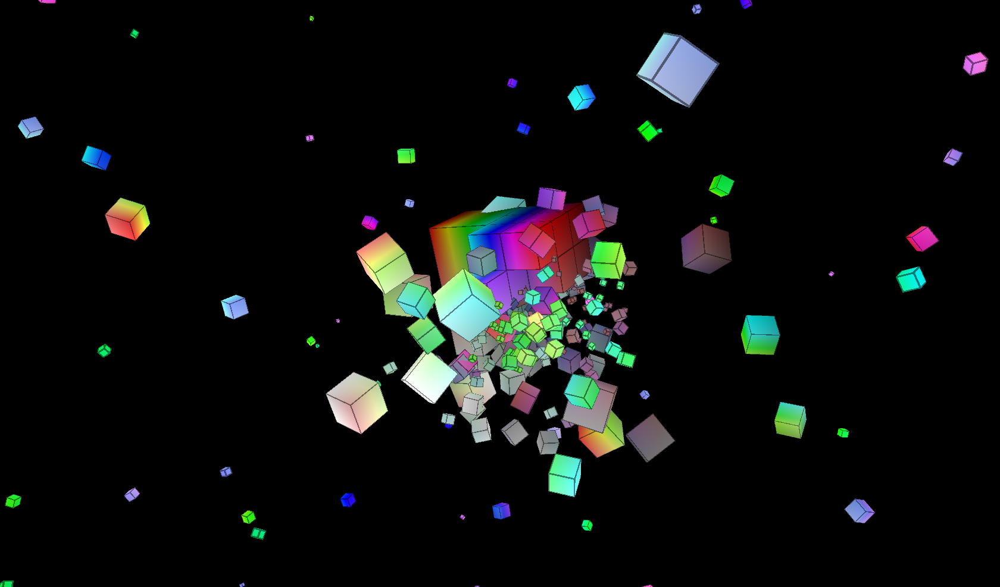
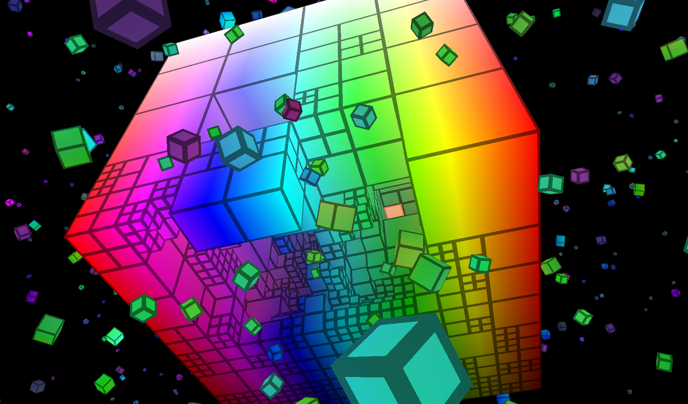

# Rust Cubes Demo

This is a simple tech demo I wrote so I could learn Rust back in 2015.
It originally used SDL2 and OpenGL 3, but now uses [miniquad](https://github.com/not-fl3/miniquad/) and is OpenGL ES compatible. As a result, it now run in WebAssembly!

## Controls

Use your mouse to hover over and explode subcubes.

* Left click: Explode (subdivide) hovered subcube
* Right click: Rearrange all subcubes into their original positions
* Middle drag: Rotate view
* Mouse wheel: Zoom in/out
* Space: Hurl all subcubes outward
* "O" key: Toggle outlines
* "R" key: Reset to a single subcube

## Screenshots




## Build instructions

Install Rust and Cargo using rustup: https://www.rust-lang.org/learn/get-started

Then build the project and run it:

```sh
cargo build
cargo run
```

## My impression of Rust (2015)

The experience I had with Rust was mostly pleasant.
It's a serious breath of fresh air, having done similar projects in C++.
The only caveat for me so far is the language's infancy and frequent changes
in Rust nightly. This will obviously go away over time, when Rust reaches 1.0 in
a few months.

I recommend Rust for _anybody_ who is familiar with C or C++.
